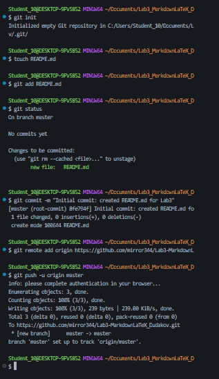

# **Лабораторная работа №3.** Работа с Markdown-разметкой и базовое использование LaTeX в документации проекта

## Описание
**Цель лабораторной работы** изучить основные возможности языка разметки *Markdown*. В ходе неё был изучен ситаксис ***заголовков, горизонтальных линий, текстового форматирования, создание списков, таблиц, добавление ссылок и изображений, форматирование блоков кода и цитат, добавление чекбоксов, сносок, Alert-блоков, Escape-символов, разметка при помощи HTML-тегов и синтакис LaTeX.***

## Содержание
* [Название проекта](#лабораторная-работа-3-работа-с-markdown-разметкой-и-базовое-использование-latex-в-документации-проекта)
* [Описание проекта](#описание)
* [Структура проекта](#структура-проекта)
* [Примеры Markdown-элементов](#примеры-markdown-элементов)

## Структура проекта
* docs/
    * advancedMarkdownLab3_Dudakov.md
    * formattingLab3_Dudakov.md
    * latexLab3_Dudakov.md
    * listsLab3_Dudakov.md
    * separatorsLab3_Dudakov.md
    * codeQuotesLab3_Dudakov.md
    * headersLab3_Dudakov.md
    * linksImagesLab3_Dudakov.md
    * ReadmePushLab3_Dudakov.md
    * tablesLab3_Dudakov.md
* img/
    * advancedMarkdownCommitLab3_Dudakov.png
    * commitStructureLab3_Dudakov.PNG
    * gitPushLab3_Dudakov.PNG
    * latexCommitLab3_Dudakov.png
    * listsCommitLab3_Dudakov.PNG
    * tablesCommitLab3_Dudakov.png
    * codeCommitLab3_Dudakov.png
    * formattingCommitLab3_Dudakov.PNG
    * headersCommitLab3_Dudakov.PNG
    * linksCommitLab3_Dudakov.png
    * separatorsCommitLab3_Dudakov.PNG
* latex/
* FormatDemo.cs
* Lab3_MarkdownLaTeX_Dudakov.csproj
* README.md


## Примеры Markdown-элементов
1. **Заголовки**
    # Заголовок H1
    ## Заголовок H2
    ### Заголовок H3
2. **Горизонтальная линия**

    ---
3. **Форматирование текста**
    **полужирный**
    *курсив*
    ~~зачеркнутый~~
    `моноширный`
4. **Списки**
    Нумерованный
    1. Первый пункт
    2. Второй пункт

    Маркированный
    * Пункт 
    * Пункт

    Вложенный
    * Пункт 
        * Подпункт
    * Пункт
        * Подпункт

5. **Цитата**
    > Обычная цитата

6. **Блок кода**
    ```csharp

    Console.WriteLine("Введите первое число:");
    double a = double.Parse(Console.ReadLine());
    Console.WriteLine("Введите второе число:");
    double b = double.Parse(Console.ReadLine());
    double sum = a + b;
    Console.WriteLine($"Результат: {sum}");
    ```

7. **Таблица**
    | **Функция** | **Команда Git** | **Описание** |
    |:-------|:-----:|----:|
    | Создание репозитория| **git init**| Иницилизация репозитория |
    | Просмотр состояния | **git status** | Показывает измененные файлы |
    | Отправка на GitHub | **git push** | Загружает комммиты на сервер |

8. **Изображение** 
    

9. **Ссылки**
    Внешняя:
    [Markdown Guide](https://www.markdownguide.org/)
    Внутренняя:
    [Содержание](#содержание)

10. **Чекбоксы**
    - [ ] Task 1
    - [x] Task 2

11. **Сноска**
    Markdown полезен в разработке[^1].

12. **Alert-блоки GitHub**
    * >[!NOTE]
        Это простая заметка
    * >[!TIP]
        Полезный совет
    * >[!WARNING]
        Предупреждение

13. **Inline LaTeX**
    Площадь круга: $S = \pi r^2$

14. **Block LaTeX**
    $$
    \sum_{i=1}^n i = \frac{n(n+1)}{2}
    $$


[^1]: Ситакисис Markdown поддерживается на GitHub, GitLab, в больгинстве редакторов кода и систем документации